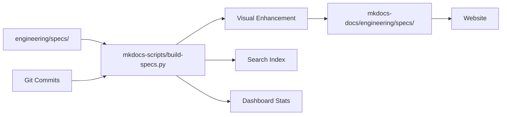

# NextPM 🚀

**AI-Native Spec-Driven Development Showcase** - Living laboratory demonstrating AI-era product management and development workflows

[](https://squidfunk.github.io/mkdocs-material/)
[](https://azure.microsoft.com/services/app-service/static/)
[](#ai-native-development)

## 🎯 What is NextPM?

NextPM demonstrates **next-generation spec-driven development** with AI assistance. This site showcases cutting-edge PM workflows where specifications drive development, complete with visual timelines, real-time search, and automated tracking from idea to deployment.

### Living Laboratory

This project uses itself as the development target - it's a **living demonstration** of AI-assisted spec-driven development. Every feature you see was built using the methodology it showcases.

## 🌟 Key Features Demonstrated

### **AI-Assisted Development**
- **Spec-driven workflow** with Claude Code integration
- **Visual timeline system** showing development progression
- **Real-time search** with client-side indexing
- **Automated commit tracking** linking specs to implementation

### **Enhanced User Experience**
- **Interactive dashboard** with live statistics
- **Responsive design** working on all devices
- **Animated visual timelines** using CSS3 hardware acceleration
- **Smart search and filtering** across all specifications

### **Modern Architecture**
- **Static site generation** with enhanced interactivity
- **Build-time processing** for performance
- **Clean folder structure** with perfect source→published alignment
- **Framework-specific tooling** for clear separation

## 🚀 How It Works



1. **PM writes specification** in `engineering/specs/YYYY-MM-DD-nn-name.md`
2. **Enhanced build system** processes with state management and visual timelines
3. **Developer commits code** with spec reference: `#2026-02-13-01`
4. **System auto-generates** implementation summaries and commit timelines
5. **Website displays** complete traceability from spec to deployment

## 📁 Repository Structure

```
NextPM/
├── mkdocs-docs/          # Website content (markdown files)
│   └── engineering/      # Engineering documentation
│       ├── specs/        # Auto-published specifications
│       └── dev-workflows/ # Implementation summaries
├── mkdocs-static/        # Static assets (CSS, JS, images)
├── engineering/          # Working artifacts (source of truth)
│   ├── specs/           # PM specifications (source)
│   ├── tasks/           # Task breakdowns for features
│   ├── templates/       # Templates for specs and summaries
│   └── validations/     # Test reports and validation docs
├── mkdocs-scripts/       # Build automation and enhancement scripts
├── meta/                 # Architecture Decision Records (ADRs)
├── mkdocs.yml           # MkDocs configuration (navigation, theme)
└── requirements.txt     # Python dependencies
```

## 🛠️ Development Commands

```bash
# Install dependencies (first time setup)
pip install -r requirements.txt

# Serve documentation locally (with automated spec processing)
python mkdocs-scripts/serve.py

# Alternative: Manual approach
python mkdocs-scripts/build-specs.py && mkdocs serve

# Default port: http://localhost:8002
# Use different port if needed: python mkdocs-scripts/serve.py -a localhost:8001

# Build static site (with automated spec processing)
python mkdocs-scripts/build.py

# Build with strict mode (fails on warnings - used in CI/CD)
python mkdocs-scripts/build.py --strict
```

## 🎯 Perfect for Learning

### **Product Managers**
- See how **spec-driven development** actually works in practice
- Experience **AI-assisted PM workflows** in action
- Learn **visual state management** for better spec tracking

### **Developers**
- Understand how **specs drive development** with real examples
- See **git integration** creating automatic documentation
- Experience **bidirectional linking** between specs and code

### **AI Enthusiasts**
- Explore **Claude Code integration** for spec-driven development
- See **AI-enhanced build processes** in action
- Learn **practical AI workflows** for software projects

## 🌐 Live Website

**Visit**: [https://kangxh.com](https://kangxh.com)

### Explore the Showcase

- **[📊 Interactive Dashboard](https://kangxh.com/engineering/dashboard/)** - Real-time search and analytics
- **[📝 Enhanced Specifications](https://kangxh.com/engineering/specs/)** - AI-enhanced specs with visual timelines
- **[🔧 Implementation Summaries](https://kangxh.com/engineering/dev-workflows/)** - Auto-generated development tracking

## 🛠️ Tech Stack

- **Static Site Generator**: MkDocs Material 9.5.0+
- **Language**: Python 3.x
- **Enhancement Scripts**: Custom build automation with git integration
- **Deployment**: Azure Static Web Apps
- **CI/CD**: GitHub Actions
- **Search**: Client-side indexing with real-time filtering
- **Animations**: CSS3 hardware-accelerated transitions

## 🎨 AI-Native Development

### **Spec-Driven Workflow**
Every feature starts with a specification in `engineering/specs/` using the naming convention `YYYY-MM-DD-nn-descriptive-name.md`. Specs include:

- **Status tracking** with visual state badges
- **Development timeline** linked to actual git commits
- **AI assistance documentation** showing Claude Code integration
- **Automated publishing** to website with visual enhancements

### **Git Integration**
Commits reference specs using the pattern `#YYYY-MM-DD-nn` for automatic linking:

```bash
git commit -m "feat: implement visual timeline system (#2026-02-13-01)"
```

### **Build-Time Enhancement**
The `mkdocs-scripts/build-specs.py` system automatically:

- Processes specs with state management and visual timelines
- Generates search index for real-time filtering
- Creates commit timeline visualizations
- Updates dashboard statistics
- Handles spec-to-website publishing workflow

## 🤝 For AI Assistants

**For Claude Code**: Read [CLAUDE.md](CLAUDE.md) for comprehensive guidance when working with this repository.

This repository demonstrates practical AI-native development patterns including:
- Comprehensive AI context documentation
- Spec-driven development methodology
- Automated enhancement and publishing workflows
- AI-assisted build processes

## 📄 License

MIT License - See [LICENSE](LICENSE) for details

## 👤 Author

**Kang** - Product Manager exploring AI-native development workflows

- **Website**: [kangxh.com](https://kangxh.com)
- **Focus**: Spec-driven development with AI assistance
- **Tools**: Claude Code, MkDocs Material, Azure Static Web Apps

---

## 📖 About This Project

NextPM represents the **future of AI-native product management**. It's both a showcase and a working example of how AI can transform traditional PM workflows into dynamic, visual, and highly automated processes.

**Ready to explore?** Start with the [📊 Interactive Dashboard](https://kangxh.com/engineering/dashboard/) or browse the [📝 Enhanced Specifications](https://kangxh.com/engineering/specs/)!

**Built with Claude Code assistance** - This project practices what it preaches! 🚀