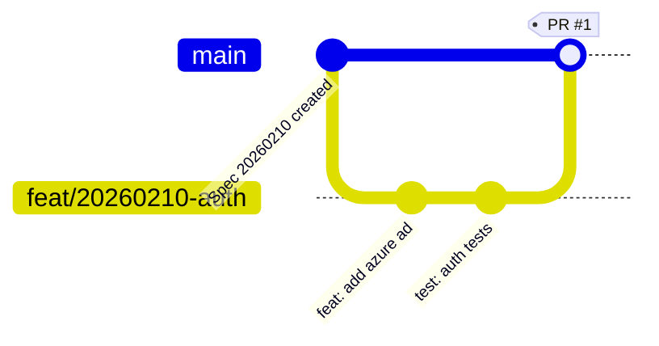

---
metadata:
  spec_id: "20260219-dashboard"
  title: "Enhanced Dashboard with Table View and Activity Graph"
  status: "draft"
  created_date: "2026-02-19"
  updated_date: "2026-02-19"
  version: "1.0"
  author: "Kang"
  priority: "high"
  category: "nextpm-feature"
  estimated_hours: 16
  actual_hours: 0
  demonstrates:
    - "data-visualization"
    - "git-workflow-visualization"
    - "interactive-tables"
    - "spec-driven-development"
  related_specs:
    - "20260219-pr-tracking"
    - "20260213-spec-showcase"
  notes: "Enhanced dashboard with table view and gitflow-style activity visualization"
---

# 20260219-dashboard

**Date:** 2026-02-19
**Version:** 1.0

> **Related:** See [20260219-pr-tracking](20260219-pr-tracking.md) for PR tracking implementation and [20260213-spec-showcase](20260213-spec-showcase.md) for visual timeline features.

## Overview

Transform the NextPM dashboard into a comprehensive project management interface featuring a sortable/filterable table view of all specifications and a gitflow-style activity graph showing the complete development history (specs → commits → PRs → merges) in a visual timeline similar to Git branching workflows.

## Problem

**Current State:**
- Dashboard shows basic statistics (total specs, commits, PRs) with simple stat cards
- No table view for browsing and comparing specs at a glance
- No visual representation of development activity flow
- Cannot see the relationship between specs, branches, commits, and PRs
- Difficult to understand the development timeline across multiple features

**Pain Points:**
- **No Quick Overview**: Cannot quickly scan all specs with their key attributes (status, priority, hours, activity)
- **No Filtering/Sorting**: Cannot find specs by status, priority, or date without reading each one
- **No Activity Visualization**: Cannot see how development flows from spec → branch → commits → PR → merge
- **Limited Project Insights**: No visual way to see which specs are active, completed, or stalled
- **Missing Git Workflow Context**: Cannot see the branching and merging patterns that demonstrate PR workflow

## User Impact

**Primary Users:**
- **Product Managers** - Need table view to track spec status, priorities, and progress at a glance
- **Developers** - Need activity graph to understand development flow and see which specs are actively being worked on
- **Portfolio Viewers** - Want to see professional project management and Git workflow visualization

**User Benefits:**
- Quick filtering/sorting of specs by status, priority, date, or hours
- Visual gitflow-style graph showing complete development timeline
- Clear understanding of which specs are in progress vs completed
- Professional demonstration of spec-driven development with Git workflows
- Easy identification of active development streams and merge patterns

## Proposed Solution

### High-Level Approach

Enhance the existing dashboard with two major sections:

1. **Table View** - Interactive, sortable/filterable table showing all specs with key metadata
2. **Activity Graph** - Gitflow-style visualization showing specs, branches, commits, PRs, and merges over time

### Key Features

#### 1. **Spec Table View**

**Columns:**
- **Spec ID** (linked to spec page) - e.g., `20260219-dashboard`
- **Title** - Short description
- **Status** - Badge with color coding (draft/in-progress/completed/archived)
- **Priority** - Badge (low/medium/high/critical)
- **Estimated Hours** - Planned effort
- **Actual Hours** - Time spent
- **Commits** - Count of linked commits
- **PRs** - Count of linked PRs
- **Last Updated** - Most recent activity date
- **Author** - Spec creator

**Interactions:**
- Click column headers to sort (ascending/descending)
- Filter by status using dropdown or buttons
- Filter by priority using dropdown or buttons
- Search by spec ID or title
- Click row to navigate to spec page

**Visual Design:**
- Clean, modern table with hover effects
- Color-coded status badges (draft=gray, in-progress=blue, completed=green, archived=purple)
- Priority badges with icons (low=▽, medium=◇, high=△, critical=⚠️)
- Responsive layout for mobile/tablet

#### 2. **Activity Graph (Gitflow Style)**

**Graph Structure:**
```
Timeline (horizontal, newest on right) →

Master Branch (main horizontal line)
    ├─ Spec 20260210 created
    │   └─ feat/20260210-auth branch
    │       ├─ commit A
    │       ├─ commit B
    │       └─ PR #1 → merge to master
    │
    ├─ Spec 20260213 created
    │   ├─ feat/20260213-spec branch
    │   │   ├─ commit C
    │   │   └─ PR #2 → merge to master
    │   │
    │   └─ feat/20260213-impl branch
    │       ├─ commit D
    │       ├─ commit E
    │       └─ PR #3 → merge to master
    │
    └─ Current state
```

**Visual Elements:**
- **Master branch line** - Horizontal line representing main branch
- **Feature branch lines** - Branches extending from master, showing parallel work
- **Spec nodes** - Diamond shapes for spec creation events
- **Commit nodes** - Circles showing individual commits
- **PR nodes** - Rounded rectangles showing pull requests
- **Merge arrows** - Curved lines showing PR merges back to master
- **Color coding** - Different colors for specs, commits, PRs (matching timeline badges)

**Interactions:**
- Hover over nodes to see details (commit message, PR title, author, date)
- Click nodes to navigate to commit, PR, or spec page
- Zoom in/out to see more/less detail
- Pan left/right to navigate timeline
- Toggle to show/hide completed specs

**Time Scale:**
- X-axis shows dates (day/week/month granularity)
- Auto-adjust scale based on activity density
- Show relative time labels ("2 days ago", "1 week ago")

### Technical Design

**Architecture:**

```
Dashboard Page (mkdocs-docs/engineering/dashboard.md)
    ↓
Enhanced mkdocs-scripts/build-specs.py
    - generate_spec_table_data()
    - generate_activity_graph_data()
    - inject_dashboard_components()
    ↓
mkdocs-static/js/dashboard.js (NEW)
    - Table sorting/filtering logic
    - Activity graph rendering (D3.js or Canvas API)
    ↓
mkdocs-static/css/dashboard.css (NEW)
    - Table styling
    - Graph visualization styles
```

**Data Structure:**

Table data embedded in dashboard.md:
```html
<script id="spec-table-data" type="application/json">
{
  "specs": [
    {
      "id": "20260219-dashboard",
      "title": "Enhanced Dashboard",
      "status": "draft",
      "priority": "high",
      "estimated_hours": 16,
      "actual_hours": 0,
      "commits": 0,
      "prs": 0,
      "last_updated": "2026-02-19",
      "author": "Kang",
      "url": "engineering/specs/20260219-dashboard.md"
    }
  ]
}
</script>
```

Activity graph data:
```html
<script id="activity-graph-data" type="application/json">
{
  "timeline": [
    {
      "type": "spec",
      "id": "20260210-authentication",
      "date": "2026-02-10",
      "title": "Authentication Spec",
      "branches": [
        {
          "name": "feat/20260210-auth",
          "created": "2026-02-10",
          "commits": [
            {"hash": "abc123", "message": "feat: add auth", "date": "2026-02-10", "author": "Kang"}
          ],
          "pr": {
            "number": 1,
            "title": "Implement authentication",
            "merged": "2026-02-10",
            "url": "https://github.com/kangxh75/NextPM/pull/1"
          }
        }
      ]
    }
  ]
}
</script>
```

**Technology Stack:**
- **Table**: Vanilla JS with simple sort/filter logic (no heavy framework needed)
- **Activity Graph**:
  - Option 1: D3.js for SVG-based interactive graph (more flexible, better for complex interactions)
  - Option 2: HTML Canvas API for rendering (better performance for large datasets)
  - **Recommendation**: Start with D3.js for easier development, migrate to Canvas if performance issues arise

**Files to Create:**
- `mkdocs-static/js/dashboard.js` - Table and graph JavaScript
- `mkdocs-static/css/dashboard.css` - Dashboard-specific styles
- `mkdocs-static/js/d3.min.js` - D3.js library (CDN or local copy)

**Files to Modify:**
- `mkdocs-scripts/build-specs.py`:
  - `generate_spec_table_data()` - Extract table data from all specs
  - `generate_activity_graph_data()` - Construct timeline from specs, commits, PRs
  - `generate_spec_dashboard()` - Inject both table and graph data into dashboard.md
- `mkdocs-docs/engineering/dashboard.md`:
  - Add table container div
  - Add graph container div
  - Include embedded JSON data
- `mkdocs.yml`:
  - Add dashboard.js and dashboard.css to extra_javascript and extra_css

### Implementation Phases

**Phase 1: Spec Table View**
1. Extend `build-specs.py` to generate table data from search index
2. Create dashboard.js with table rendering logic
3. Implement sorting (by column click)
4. Implement filtering (by status, priority)
5. Add search functionality (by spec ID or title)
6. Style table with CSS (responsive, hover effects, badges)

**Phase 2: Activity Graph**
1. Design graph data structure (specs, branches, commits, PRs, merges)
2. Implement `generate_activity_graph_data()` in build-specs.py
3. Integrate D3.js library
4. Render basic gitflow layout (master branch + feature branches)
5. Add nodes for specs, commits, PRs
6. Add merge arrows and branch lines
7. Implement hover tooltips
8. Add zoom/pan controls
9. Add click navigation to spec/commit/PR pages

**Phase 3: Polish and Optimization**
1. Add responsive design for mobile/tablet
2. Optimize graph rendering for many specs (virtualization if needed)
3. Add loading states and error handling
4. Add accessibility features (keyboard navigation, ARIA labels)
5. Performance testing and optimization

## Success Metrics

### Completion Criteria

**Table View:**
- [x] Table displays all specs with 10 columns (ID, title, status, priority, hours, commits, PRs, date, author)
- [x] Click column headers to sort ascending/descending
- [x] Filter by status (draft/in-progress/completed/archived)
- [x] Filter by priority (low/medium/high/critical)
- [x] Search by spec ID or title
- [x] Click row to navigate to spec page
- [x] Responsive layout works on mobile/tablet/desktop
- [x] Status and priority badges show correct colors and icons

**Activity Graph:**
- [x] Graph shows horizontal timeline with master branch
- [x] Feature branches display for each spec with PR workflow
- [x] Commit nodes show individual commits with author and date
- [x] PR nodes show pull request info with merge status
- [x] Merge arrows connect PRs back to master
- [x] Hover tooltips show details for each node
- [x] Click nodes to navigate to spec/commit/PR pages
- [x] Zoom in/out controls work smoothly
- [x] Pan left/right to navigate timeline
- [x] Color coding matches existing timeline badges (commits=gray, PRs=purple, specs=blue)

**Build Process:**
- [x] `python mkdocs-scripts/build-specs.py` generates table and graph data
- [x] Dashboard page includes embedded JSON data
- [x] JavaScript loads and renders both components
- [x] Build completes without errors in strict mode
- [x] Dashboard loads in under 2 seconds with 50 specs

### Quality Indicators

**User Experience:**
- Table sorting responds instantly (< 100ms)
- Graph renders smoothly without jank
- Hover tooltips appear within 200ms
- All interactions feel responsive and smooth
- Mobile layout is usable without horizontal scrolling

**Visual Quality:**
- Graph resembles professional gitflow diagrams from Atlassian/GitHub
- Colors are consistent with existing NextPM theme (indigo/purple scheme)
- Typography is clear and readable at all zoom levels
- Animations are smooth (60fps)

**Code Quality:**
- JavaScript follows ES6+ best practices
- No console errors or warnings
- D3.js code is modular and maintainable
- Performance profiling shows no bottlenecks

### User Acceptance

- Product managers can quickly find specs by status or priority
- Developers can see active development branches and recent merges
- Portfolio viewers can understand the project's Git workflow at a glance
- Graph clearly shows parallel development streams
- Table provides quick overview without needing to read individual specs

## Implementation Notes

### D3.js Graph Implementation Tips

**Graph Layout:**
- Use `d3.scaleTime()` for X-axis (timeline dates)
- Use fixed Y-axis positions for master branch and feature branches
- Calculate branch Y-offset dynamically based on number of parallel branches
- Use cubic bezier curves for merge arrows: `d3.line().curve(d3.curveBasis)`

**Performance Optimization:**
- Lazy render nodes outside viewport (virtual scrolling)
- Use `requestAnimationFrame` for smooth animations
- Debounce zoom/pan events (throttle to 60fps)
- Cache calculated positions to avoid recalculation

**Responsive Design:**
- Scale graph container to window width
- Adjust node sizes based on zoom level
- Hide branch names at low zoom levels
- Show abbreviated commit messages on hover

### Git Data Collection

Extend existing `collect_git_data()` and `collect_pr_data()` functions:

```python
def collect_activity_timeline():
    """Collect all git activity for dashboard timeline graph."""
    timeline = []

    for spec in all_specs:
        spec_id = spec['id']

        # Get all branches that reference this spec
        branches = get_branches_for_spec(spec_id)

        for branch in branches:
            commits = get_commits_for_branch(branch, spec_id)
            pr = get_pr_for_branch(branch)

            timeline.append({
                'spec_id': spec_id,
                'branch': branch,
                'commits': commits,
                'pr': pr
            })

    # Sort by date
    timeline.sort(key=lambda x: x['commits'][0]['date'] if x['commits'] else x['spec']['date'])

    return timeline
```

### Alternative: Mermaid Diagrams

If D3.js proves too complex, consider using Mermaid diagrams (already enabled in mkdocs.yml):

```markdown

```

**Pros**: Simpler, no JavaScript required, auto-renders
**Cons**: Less interactive, limited customization, no zoom/pan

**Decision**: Use D3.js for full control and interactivity, but prototype with Mermaid first to validate layout

## Out of Scope

**For v1.0 (this feature):**
- ❌ Real-time updates (dashboard requires rebuild to show new data)
- ❌ Export table to CSV/Excel
- ❌ Custom chart/graph types (bar charts, pie charts)
- ❌ Filtering by date range or author
- ❌ Advanced search with regex or multiple criteria
- ❌ GitHub API integration for live PR status
- ❌ Commit diff viewer in dashboard
- ❌ Branch comparison tool
- ❌ Animated graph transitions showing how timeline evolves
- ❌ Multi-user collaboration features (comments, reviews)

**Explicitly Deferred to v2.0:**
- Gantt chart view for project planning
- Burndown charts for sprint tracking
- Custom dashboard widgets (configurable by user)
- Dashboard customization (show/hide sections, reorder)

## Risks & Mitigations

| Risk | Impact | Mitigation |
|------|--------|-----------|
| D3.js learning curve steep | High | Start with Mermaid prototype, migrate to D3.js incrementally; use D3 tutorials and examples |
| Large graph with 100+ specs becomes slow | Medium | Implement virtual scrolling, limit visible nodes, add pagination or date range filtering |
| Complex git history with many branches hard to visualize | Medium | Simplify graph by grouping commits, showing only PR-related branches, hide merged branches |
| Mobile/tablet graph interaction challenging | Low | Provide pinch-to-zoom, swipe-to-pan gestures; add fallback table view for small screens |
| Browser compatibility issues with D3.js | Low | Test on Chrome, Firefox, Safari, Edge; provide fallback message for unsupported browsers |

## References

### Internal Documents

- [20260219-pr-tracking](20260219-pr-tracking.md) - PR tracking system that provides data for activity graph
- [20260213-spec-showcase](20260213-spec-showcase.md) - Visual timeline features and state management
- [CLAUDE.md](../../CLAUDE.md) - Build process and architecture overview

### External Resources

- [Atlassian Gitflow Workflow](https://www.atlassian.com/git/tutorials/comparing-workflows/gitflow-workflow) - Inspiration for activity graph visualization
- [D3.js Graph Gallery](https://d3-graph-gallery.com/) - D3.js examples and tutorials
- [GitHub Network Graph](https://github.com/kangxh75/NextPM/network) - GitHub's built-in graph visualization
- [Mermaid Git Graphs](https://mermaid.js.org/syntax/gitgraph.html) - Mermaid diagram syntax for git graphs

## Next Steps

1. Review and approve this specification
2. Create task breakdown in `/project/tasks/20260219-dashboard-tasks.md`
3. Begin Phase 1: Spec table view implementation
4. Prototype activity graph with Mermaid to validate layout
5. Implement D3.js activity graph
6. Test and polish interactions
7. Create PR for implementation review

## Change History

### Version 1.0 - 2026-02-19

- Initial spec creation
- Defined two-part dashboard: table view + activity graph
- Specified gitflow-style visualization inspired by Atlassian
- Established D3.js as primary technology with Mermaid fallback
- Scoped to build-time data generation (no real-time updates)
- Set success criteria for table sorting/filtering and graph interactions

---

**Document Metadata:**
- **Spec Version:** 1.0
- **Created:** 2026-02-19
- **Author:** Kang (with AI assistance from Claude Sonnet 4.5)
- **Last Updated:** 2026-02-19
- **Related Specs:** 20260219-pr-tracking, 20260213-spec-showcase
- **Status:** Living document
