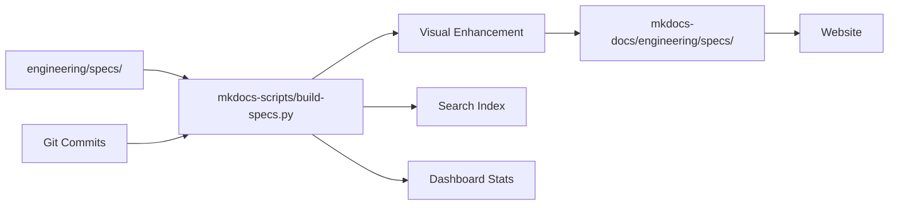

# Welcome to NextPM 🚀

**AI-Native Product Management Showcase**

## What is NextPM?

NextPM demonstrates **next-generation spec-driven development** with AI assistance. This site showcases cutting-edge PM workflows where specifications drive development, complete with visual timelines, real-time search, and automated tracking from idea to deployment.

!!! tip "Living Laboratory"
    This project uses itself as the development target - it's a **living demonstration** of AI-assisted spec-driven development. Every feature you see was built using the methodology it showcases.

## 🎯 Explore the Showcase

### [📊 Interactive Dashboard](engineering/dashboard.md)
Real-time search and analytics for all specifications:

- **🔍 Advanced Search** - Full-text search across all specs
- **🎛️ Smart Filtering** - By status, priority, category, and more
- **📈 Live Statistics** - Real-time progress tracking
- **🎨 Visual Interface** - Animated, responsive design

### [📝 Enhanced Specifications](engineering/specs/index.md)
AI-enhanced specs with visual state management:

- **🎭 Visual State Badges** - Animated status indicators (📝 draft → 🚧 in-progress → 🎉 completed)
- **⏱️ Development Timelines** - See real commits linked to each spec
- **🔄 State History** - Complete evolution tracking
- **🎯 Automated Publishing** - Source specs auto-enhance with timelines

### [🔧 Implementation Summaries](engineering/dev-workflows/index.md)
Auto-generated development tracking:

- **🤖 AI-Generated** - Automatically created from git commits
- **🔗 Bidirectional Linking** - Specs ↔ commits ↔ summaries
- **📊 Development Statistics** - Files changed, contributors, progress
- **⚡ Real-time Updates** - Regenerated on every build

## 🌟 Key Features Demonstrated

### **AI-Assisted Development**
- **Spec-driven workflow** with Claude Code integration
- **Visual timeline system** showing development progression
- **Real-time search** with client-side indexing
- **Automated commit tracking** linking specs to implementation

### **Enhanced User Experience**
- **Interactive dashboard** with live statistics
- **Responsive design** working on all devices
- **Dark mode support** throughout the entire site
- **Smooth animations** using CSS3 hardware acceleration

### **Modern Architecture**
- **Static site generation** with enhanced interactivity
- **Build-time processing** for performance
- **Framework-specific tooling** (`mkdocs-scripts/` for clear separation)
- **Clean folder structure** with perfect source→published alignment

## 🚀 How It Works

1. **PM writes specification** in `engineering/specs/YYYY-MM-DD-nn-name.md`
2. **Enhanced build system** processes with state management and visual timelines
3. **Developer commits code** with spec reference: `#2026-02-13-01`
4. **System auto-generates** implementation summaries and commit timelines
5. **Website displays** complete traceability from spec to deployment

## 🎯 Perfect for Learning

### **Product Managers**
- See how **spec-driven development** actually works in practice
- Experience **AI-assisted PM workflows** in action
- Learn **visual state management** for better spec tracking

### **Developers**
- Understand how **specs drive development** with real examples
- See **git integration** creating automatic documentation
- Experience **bidirectional linking** between specs and code

### **AI Enthusiasts**
- Explore **Claude Code integration** for spec-driven development
- See **AI-enhanced build processes** in action
- Learn **practical AI workflows** for software projects

## 📖 About This Project

NextPM represents the **future of AI-native product management**. It's both a showcase and a working example of how AI can transform traditional PM workflows into dynamic, visual, and highly automated processes.

**Built with:** MkDocs Material, Claude Code assistance, GitHub Actions, Azure Static Web Apps

**Architecture:** Static site with enhanced interactivity, build-time processing, client-side search

---

**Ready to explore?** Start with the [📊 Interactive Dashboard](engineering/dashboard.md) or browse the [📝 Enhanced Specifications](engineering/specs/index.md)!